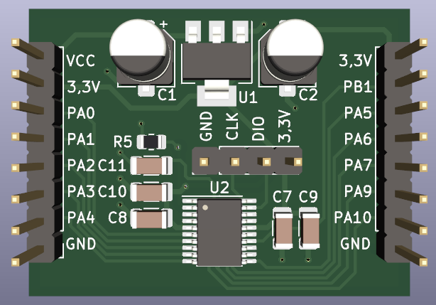
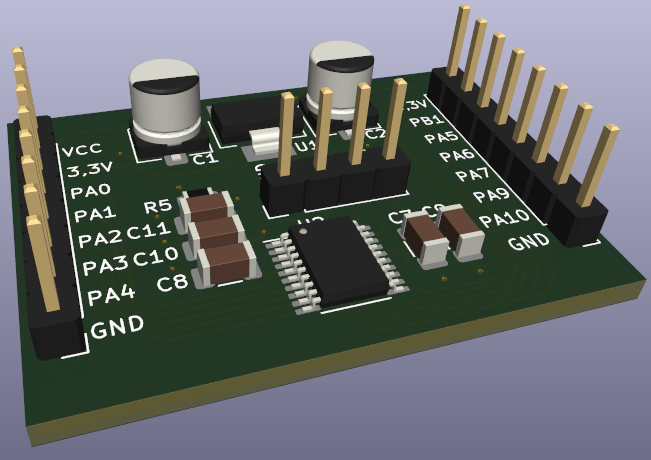

# STM32F030F4-TestBoard

## Summary

Simple breadbord compatible testboard based on the STM32F030F4.
I created this pcb to test various applications with the STM32F030F4.
The SWD-Port is accessable through a seperate pinheader for programming.

## Screenshots

## BOM

| **Designator** | **Quantity** | **Value**   | **LCSC** |
|----------------|--------------|-------------|----------|
| C1, C2         | 2            | 10 uF       | C72487   |
| C7, C8, C11    | 3            | 100 nF      | C110253  |
| C9, C10        | 2            | 1 uF        | C1848    |
| R5             | 1            | 0 Ohm       | C100045  |
| U1             | 1            | LM1117-3.3  | C126027  |
| U2             | 1            | STM32F030F4 | C89040   |
